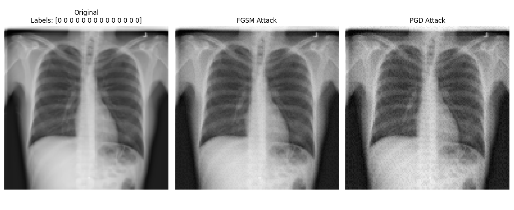

# 🩺 Robust Chest X-Ray Disease Classification with Adversarial Training

This project implements a deep learning pipeline for **chest X-ray disease classification** using the **ChestMNIST dataset**.  
Beyond standard training, it integrates adversarial robustness techniques such as **FGSM (Fast Gradient Sign Method)** and **PGD (Projected Gradient Descent)** to evaluate and improve the reliability of medical AI systems against adversarial perturbations.

---

## 📂 Dataset: ChestMNIST

We use the **ChestMNIST** dataset from **MedMNIST v2**.  
It contains **112,120 frontal-view chest X-ray images**, labeled for **14 thoracic diseases**.

**Train / Validation / Test split:**
- Train: **78,468**
- Validation: **11,219**
- Test: **22,433**

**Available Resolutions:**
- `chestmnist_28.npz` → **28×28 pixels** (for small compute)
- `chestmnist_128.npz` → **128×128 pixels** (✅ recommended)
- `chestmnist_224.npz` → **224×224 pixels** (for high compute power, GPU required)

**Install via pip:**
```bash
pip install medmnist
```
Or download manually from [Zenodo](https://zenodo.org/records/10519652).

👉 In the code, change the dataset resolution here:
```python
data = np.load("chestmnist_128.npz")
```

# ⚡ Adversarial Attacks Implemented

## ✅ FGSM (Fast Gradient Sign Method)
- Perturbs the image in the gradient’s sign direction scaled by ε.
- Larger epsilon → stronger perturbation (more visible changes, higher attack success).

## ✅ PGD (Projected Gradient Descent)
- Iterative attack that applies FGSM multiple times with smaller steps (alpha).
- Stronger and more effective at fooling the model.

# 🧪 Model Architecture
A CNN (Convolutional Neural Network) with the following components:
- Convolution + BatchNorm + Pooling layers
- Global Average Pooling
- Fully connected layers with dropout
- Output: 14 sigmoid-activated neurons (multi-label classification)

**Training details:**
- Optimizer: Adam with exponential decay learning rate schedule
- Loss: Binary Crossentropy
- Metrics: Binary Accuracy, AUC (multi-label)

# 📊 Results

### 🔹 Training data without adversarial attacks
- Clean Model - Test Accuracy: 0.9488, Test AUC: 0.7510  
- FGSM Attack: Accuracy = 0.9330, AUC = 0.1670  
- PGD Attack: Accuracy = 0.9166, AUC = 0.0627  

> ⚠️ Note: Although the accuracy remains relatively high under FGSM/PGD attacks, the AUC is extremely low—much worse than a random classifier (AUC ≈ 0.5). This means the model's predictions are essentially unreliable for distinguishing classes, and the high accuracy is misleading due to class imbalance or prediction bias.

### 🔹 Training data with adversarial examples (FGSM + PGD)
- Clean Model - Test Accuracy: 0.9451, Test AUC: 0.7334  
- FGSM Attack: Accuracy = 0.9248, AUC = 0.7081  
- PGD Attack: Accuracy = 0.9022, AUC = 0.6212  

> ⚠️ Note: Adversarial training improves robustness, reflected in higher AUC under attacks, but the AUC is still lower than the clean model, showing that the model is partially robust but not fully reliable under strong adversarial perturbations.


# 🖼️ Visualizing Adversarial Attacks
Below is an example chest X-ray image showing:
- Original (clean)
- FGSM Attack (ε = 0.05)
- PGD Attack (ε = 0.05, α = 0.01, 10 iterations)



# 🚀 How to Run

**Install requirements:**
```bash
pip install -r requirements.txt
```
**Train baseline model (clean data only):**
```bash
python diagnosis.py
```
**Train adversarially robust model (clean + adversarial data):**
```bash
python diagnosis_adv.py
```

# ⚠️ Notes

- Always use GPU acceleration for faster training.
- Higher resolution datasets (128×128 or 224×224) require more memory and compute.
- Adversarial training increases robustness but may slightly reduce clean-data accuracy.
